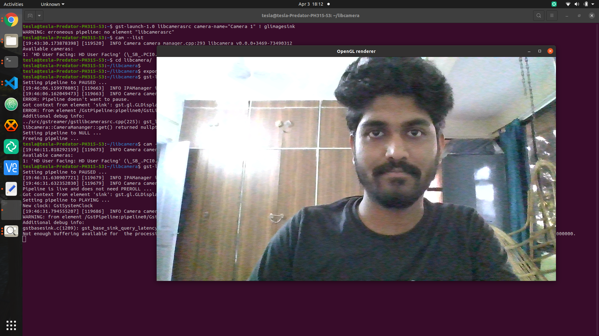
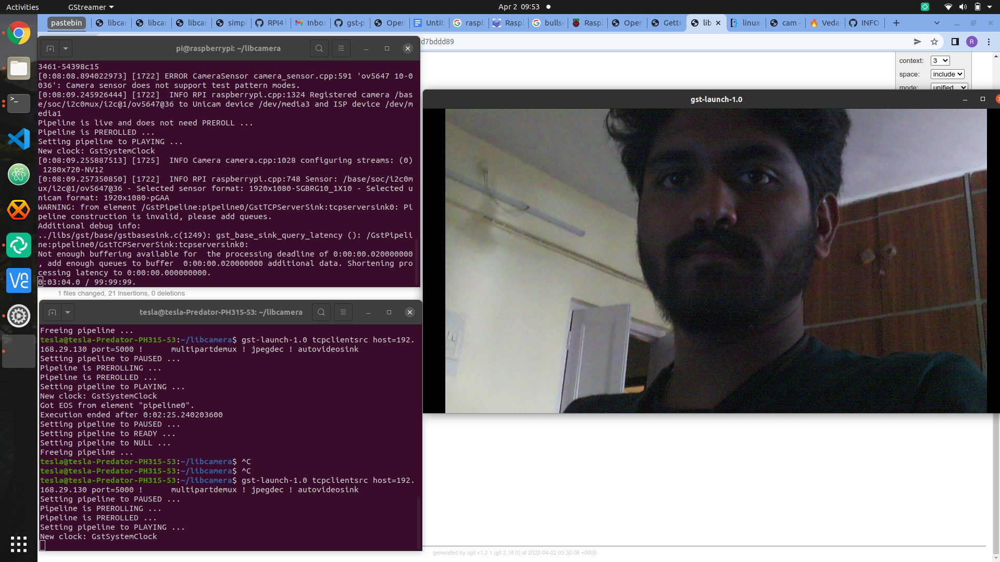

Hello, I am Rishikesh applying as a GSoC student this year in the organization libcamera.I am writing this blog when the GSoC student application period is about to begin. This blog will cover the journey of applying for the libcamera organization and the challenges I faced during it and how I tackled them.


# Introduction

## what is libcamera?
 libcamera is an open source camera stack for many platforms with a core userspace library, and support from the Linux kernel APIs and drivers already in place. It aims to control the complexity of embedded camera hardware by providing an intuitive API and method of separating untrusted vendor code from the open source core.


## Project-idea: Improve GStreamer element to add support for properties

### **Project idea introduction.**

GStreamer element is used to use libcamera as a video source in the gstreamer pipeline. Libcamera can be used to stream video using gstreamer. The aim of this project is add more control over the aspects of the stream by adding support for properties in the GStreamer element.

### **Warmup Task**

For the new open-source contributors who want to contribute in this project some warmup tasks were provided to make the new contributors familiar with the source code and how libcamera works behind the hood. All the project ideas have separate warm up tasks as I was interested in the project idea 'Improve GStreamer element to add support for properties' . I began with those tasks.

**1.Build libcamera with the GStreamer element enabled**

Followed the instruction of [getting started](https://libcamera.org/getting-started.html) page to clone and build libcamera. Faced many problems in building libcamera but was successfully able to build the project on Raspberry Pi 3 model B (1 GB ram).

* I had buster on my hardware the first step for me was to upgrade to bullseye because I wanted to use libcamera-apps. Also, I bought a 5MP Raspberry Pi 3 Model B Camera Module.
* The new bullseye OS had libcamera and required libraries perbuilt, tested the libcamera apps, was able to capture a image using 

    `libcamera-jpeg -o test.jpg`
 
 * Next step for me was to build the libcamera from the source. 
    * Installed the required Debian packages on my laptop.
    * When I tried to build the project using `meson build` I faced issues like the meson version mismatch between the root user and the normal user. For me uninstalling and installing meson in root using pip worked.
    * Next I built and installed libcamera from the source into my laptop and tested the working of libcamera by building gstreamer pipeline with libcamera as the video source using the `gst-launch-1.0` command line tool.

        To use GStreamer plugin from source tree, set the following environment so that GStreamer can find it.Ran the following command.
        ```
        export GST_PLUGIN_PATH=$(pwd)/build/src/gstreamer`

        ```

        And then to view the camera.

      ```
       gst-launch-1.0 libcamerasrc camera-name="Camera 1" ! glimagesink

      ```
    * While running the above ran into many errors, Asked the mentors on libcamera IRC and got the link to [this](https://ve0x10.in/blog/2021/libcamera-log/) blog.

        Followed the steps and was successfully able to use the libcamera’s gstreamer 
        element to view the camera.

        

**2.Stream using GStreamer from the libcamera element**

   Used the command of the getting started page to stream using the libcamera element as source in the gstreamer pipeline. To capture and encode as a JPEG stream(from the Raspberry pi 5 MP camera) and receive on another device(laptop) use the following commands from the [getting started](https://libcamera.org/getting-started.html) page.

    * To streme from Raspberry Pi edit the IP address assigned to your Raspberry Pi in the following command and enter the command into your Raspberry Pi terminal.

    ```
    gst-launch-1.0 libcamerasrc ! \
     video/x-raw,colorimetry=bt709,format=NV12,width=1280,height=720,framerate=30/1 ! \
     jpegenc ! multipartmux ! \
     tcpserversink host=0.0.0.0 port=5000

    ```

    * To recive the stream on othe device connected to the same network   as the Raspberry Pi edit the IP address of the Raspberry Pi in the following command and enter the command in the terminal of device.


    ```
    gst-launch-1.0 tcpclientsrc host=$DEVICE_IP port=5000 ! \
      multipartdemux ! jpegdec ! autovideosink

    ```

   


